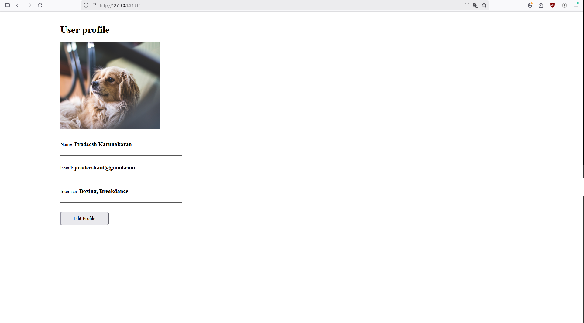

# Kubernetes Mongo + WebApp Demo

## Introduction

This project demonstrates a simple Kubernetes deployment of a web application connected to a MongoDB database. The web app allows users to view and edit their profile information, which is persisted in MongoDB. This setup serves as a basic example of running stateful and stateless applications in Kubernetes.

## Prerequisites

- Docker installed  
- Minikube installed  
- kubectl configured to interact with Minikube  
- Windows users with WSL2 enabled are fully supported  

## Installation & Setup

### 1. Install Minikube

**Linux / WSL2:**  
curl -LO https://storage.googleapis.com/minikube/releases/latest/minikube-linux-amd64

**Windows (via WSL2 / PowerShell):**  
choco install minikube

Verify installation:  
minikube version  
kubectl version --client

### 2. Start Minikube

minikube start --driver=docker

Verify cluster status:  
minikube status  
kubectl get nodes

### 3. Deploy MongoDB & WebApp

kubectl apply -f mongo-config.yaml  
kubectl apply -f mongo-secret.yaml  
kubectl apply -f mongo.yaml  
kubectl apply -f webapp.yaml

Check pods and services:  
kubectl get pods  
kubectl get svc

### 4. Access the Web Application

**Option 1: Using Minikube Service**  
minikube service webapp-service  
This automatically opens the web interface in your default browser.

**Option 2: Manual Access**  

Get Minikube IP:  
minikube ip  

Use NodePort from service:  
kubectl get svc webapp-service  

Example URL:  
http://<minikube-ip>:30100  

## User Profile Example

Name: Pradeesh Karunakaran  
Email: pradeesh.nit@gmail.com  

## Notes

- This setup is intended for learning and prototyping purposes.  
- Stopping and starting Minikube will reset the cluster unless persistent volumes are configured.  
- All commands are compatible with WSL2 and Linux environments.  
